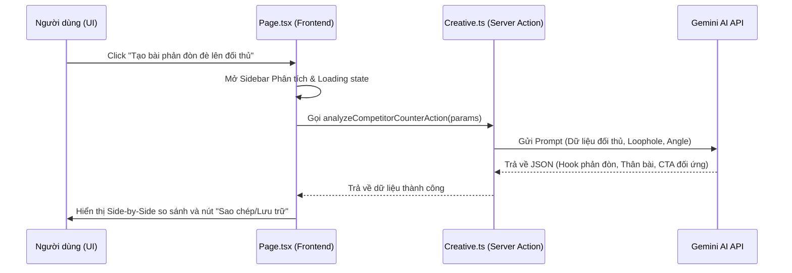

# ĐẶC TẢ THIẾT KẾ: PHÂN TÍCH ĐỐI THỦ CHUYÊN SÂU & BỘ TẠO QUẢNG CÁO PHẢN ĐÒN AI

> **Mã số đặc tả:** SPEC-ADS-CREATIVE-002  
> **Ngày tạo:** 2026-05-18  
> **Tác giả:** Antigravity (AI Coding Assistant)  
> **Trạng thái:** 🔴 DRAFT (Đang chờ duyệt)  
> **Liên kết Pull Request:** N/A  

---

## 1. 🎯 Mục tiêu & Phạm vi (Goal & Scope)

### 1.1. Mục tiêu cốt lõi
Nâng cấp tab **Phân tích Đối thủ** trong module Creative từ một màn hình hiển thị dữ liệu tĩnh thành một **Bộ công cụ tình báo đối thủ tương tác trực quan (Interactive Competitor Intelligence Suite)**. Giúp người dùng không chỉ xem thông tin đối thủ mà còn trực tiếp **bóc tách tâm lý** từng quảng cáo của họ và **tạo chiến dịch phản đòn (Counter-Ad)** đè lên điểm yếu của đối thủ chỉ với 1 click.

### 1.2. Nằm trong phạm vi (In-Scope)
* **Tính năng 1: Facebook Ad Feed Mockup Modal (Drilldown):** Click vào từng quảng cáo đối thủ để mở Modal hiển thị giao diện chân thực của Facebook Post (Avatar, Tên Fanpage, Sponsored, Text, Media placeholder đẹp mắt, Likes/Comments tương tác giả lập), đi kèm cột **Phân tích chiến thuật của AI** (Psychological trigger, Điểm mạnh, Điểm yếu).
* **Tính năng 2: Bộ tạo quảng cáo phản đòn AI (Counter-Ad Generator):** Tích hợp sâu nút **"Viết bài đè lên đối thủ"** từ các Angle gợi ý. Khi click, hệ thống sẽ tự động gọi AI sinh ra mẫu bài viết quảng cáo hoàn chỉnh được tối ưu đặc biệt để **tấn công kẽ hở (loopholes) của đối thủ** và hiển thị kết quả ngay lập tức dưới dạng tab so sánh trực tiếp (Side-by-Side Comparison).
* **Tính năng 3: Trải nghiệm UI/UX Premium:** Cập nhật hiệu ứng hover, glassmorphism, micro-animations, loading skeleton đẹp mắt, đồng màu với thiết kế tối giản hiện đại của Ads Manager.

### 1.3. Ngoài phạm vi (Out-of-Scope)
* Tích hợp cổng thanh toán hoặc quản lý tài khoản nâng cao.
* Kết nối trực tiếp vào tài khoản Facebook cá nhân của người dùng để tự động đăng bài viết (chỉ dừng ở mức độ Copy & Save).

---

## 2. 🏛️ Kiến trúc & Luồng xử lý (Architecture & Data Flow)

### 2.1. Sơ đồ luồng xử lý Counter-Ad Generator


### 2.2. Các thành phần bị ảnh hưởng (Affected Components)
* Sửa đổi [page.tsx](file:///c:/Users/admin/Desktop/Ads-Manager/src/app/creative/page.tsx): Thêm Modal xem chi tiết quảng cáo đối thủ, Sidebar hiển thị Counter-Ad, và quản lý các trạng thái UI tương ứng.
* Sửa đổi [creative.module.css](file:///c:/Users/admin/Desktop/Ads-Manager/src/app/creative/creative.module.css): Thêm style cho Facebook Feed Mockup, Modal overlay, Side-by-Side cards và các micro-animations.
* Sửa đổi [creative.ts](file:///c:/Users/admin/Desktop/Ads-Manager/src/app/actions/creative.ts): Thêm Server Action `generateCounterAdAction` hỗ trợ gọi Gemini AI sinh bài viết quảng cáo phản đòn đối thủ dựa trên Angle và Loophole đã chọn.

---

## 3. 💾 Cấu trúc dữ liệu & Thiết kế API (Data Schema & API Design)

### 3.1. Thiết kế API / Server Action mới

#### Server Action: `generateCounterAdAction`
```typescript
interface CounterAdParams {
  competitorName: string;
  competitorText: string;
  loophole: string;
  angleTitle: string;
  angleHook: string;
  ourProduct: string;
  ourUsps: string;
}

// Response Trả về:
interface CounterAdResponse {
  success: boolean;
  data?: {
    badge: string;
    targetLoophole: string;
    hook: string;
    body: string;
    cta: string;
    strategyDescription: string; // Giải thích chiến thuật phản đòn
  };
  error?: string;
}
```

---

## 4. 🛡️ Xử lý lỗi & Trường hợp biên (Error Handling & Edge Cases)

| Tình huống (Edge Case) | Cách xử lý (Handling Strategy) | Trải nghiệm người dùng (UX) |
| :--- | :--- | :--- |
| Gemini API lỗi khi tạo Counter-Ad | Catch error, sử dụng bộ generator fallback được viết sẵn theo đúng template phản đòn | Vẫn hiển thị kết quả Counter-Ad tối ưu và Toast thông báo hoàn thành |
| URL đối thủ không hợp lệ | Kiểm tra regex và báo lỗi ngay tại input | Hiển thị viền đỏ quanh ô nhập liệu và Toast thông báo lỗi |
| Bấm đóng modal khi đang gọi AI | Hủy state loading nhưng vẫn lưu trữ tiến trình ngầm để nếu người dùng mở lại sẽ có kết quả ngay | Tránh tình trạng đơ UI hoặc crash app |

---

## 5. 🧪 Kịch bản xác thực (Verification Plan)

### 5.1. Xác thực thủ công trên Trình duyệt (Browser Testing)
1. **Kiểm tra Mockup Modal:** Click vào quảng cáo bất kỳ của đối thủ -> Đảm bảo hiển thị Modal đẹp mắt dạng Facebook Post, thông tin đúng với ad card.
2. **Kiểm tra tính năng Counter-Ad:** Click nút "Tạo bài phản đòn đè lên đối thủ" ở một Angle -> Đảm bảo hiển thị Sidebar phân tích, chạy loading spinner, hiển thị Side-by-Side card với nội dung sắc bén.
3. **Kiểm tra Copy-to-Clipboard:** Click nút Sao chép ở bài phản đòn -> Đảm bảo hiển thị Toast thông báo và dữ liệu lưu vào clipboard chuẩn xác.
4. **Kiểm tra Responsive:** Thử thu nhỏ màn hình về kích thước máy tính bảng và di động -> Giao diện Mockup Modal và Side-by-Side tự động chuyển sang layout dọc mượt mà.
