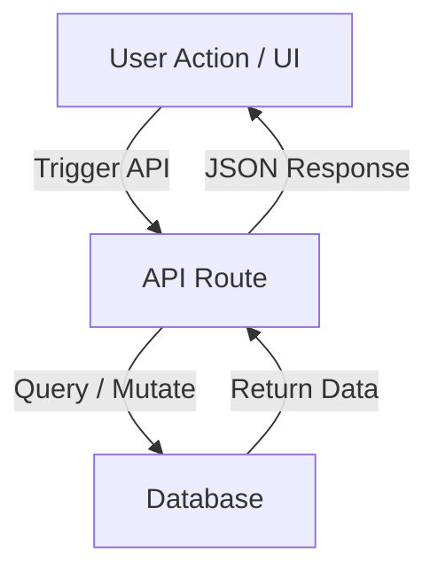

# ĐẶC TẢ THIẾT KẾ: [TÊN TÍNH NĂNG / TASK]

> **Mã số đặc tả:** SPEC-[TÊN-DỰ-ÁN]-[SỐ-THỨ-TỰ]  
> **Ngày tạo:** YYYY-MM-DD  
> **Tác giả:** [Tên Developer / AI Agent]  
> **Trạng thái:** 🔴 DRAFT (Bản nháp) / 🟢 APPROVED (Đã duyệt bởi Tech Lead/PM)  
> **Liên kết Pull Request:** [Link PR nếu có]  

---

## 1. 🎯 Mục tiêu & Phạm vi (Goal & Scope)

### 1.1. Mục tiêu cốt lõi
*Mô tả ngắn gọn (1-2 câu) mục tiêu của tính năng này. Nó giải quyết vấn đề gì cho người dùng hoặc hệ thống?*

### 1.2. Nằm trong phạm vi (In-Scope)
*Danh sách các chức năng/yêu cầu cụ thể SẼ được giải quyết trong task này.*
* - [ ] Yêu cầu 1
* - [ ] Yêu cầu 2

### 1.3. Ngoài phạm vi (Out-of-Scope)
*Những yêu cầu/tính năng liên quan nhưng SẼ KHÔNG được triển khai trong task này để tránh phình to phạm vi (scope creep).*
* - Không triển khai...
* - Không tối ưu...

---

## 2. 🏛️ Kiến trúc & Luồng dữ liệu (Architecture & Data Flow)

### 2.1. Sơ đồ khối hoặc Luồng xử lý
*Mô tả luồng đi của dữ liệu từ Frontend -> Backend -> Database hoặc ngược lại. Sử dụng sơ đồ Mermaid nếu cần.*



### 2.2. Các thành phần bị ảnh hưởng (Affected Components)
*Liệt kê các module, components, hay files hiện tại sẽ bị ảnh hưởng hoặc cần thay đổi.*
* `src/components/...`
* `src/app/...`
* `prisma/schema.prisma`

---

## 3. 💾 Cấu trúc dữ liệu & Thiết kế API (Data Schema & API Design)

### 3.1. Thay đổi Database Schema (nếu có)
*Mô tả các bảng mới, trường mới hoặc thay đổi liên kết trong database (ví dụ: Prisma schema).*

```prisma
// Ví dụ thay đổi schema
model NewModel {
  id        String   @id @default(uuid())
  name      String
  createdAt DateTime @default(now())
}
```

### 3.2. Thiết kế API Endpoints (nếu có)
*Mô tả các API Route mới hoặc sửa đổi.*

#### `POST /api/v1/your-endpoint`
* **Request Payload (JSON):**
  ```json
  {
    "field1": "value",
    "field2": 123
  }
  ```
* **Response (Success - 200 OK):**
  ```json
  {
    "success": true,
    "data": { "id": "123", "status": "active" }
  }
  ```
* **Response (Error - 400 Bad Request):**
  ```json
  {
    "success": false,
    "error": "Mô tả lỗi cụ thể"
  }
  ```

---

## 4. 🛡️ Xử lý lỗi & Trường hợp biên (Error Handling & Edge Cases)

*Lập kế hoạch trước cho các tình huống hệ thống lỗi để đảm bảo ứng dụng không crash.*

| Tình huống (Edge Case) | Cách xử lý (Handling Strategy) | Trải nghiệm người dùng (UX) |
| :--- | :--- | :--- |
| Mạng mất kết nối / API Timeout | Catch error, hiển thị thông báo retry | Hiển thị Toast thông báo và nút "Thử lại" |
| Dữ liệu đầu vào bị trống | Validation ở cả Frontend + Backend | Hiển thị lỗi đỏ dưới form field |
| Không tìm thấy bản ghi trong DB | Trả về status 404 kèm thông báo rõ ràng | Chuyển hướng về trang danh sách hoặc hiển thị trang Empty State |

---

## 5. 🧪 Kế hoạch xác thực (Verification Plan)

### 5.1. Các kịch bản kiểm thử tự động (Automated Test Cases)
*Mô tả các test case cụ thể sẽ được viết trước khi code (TDD Red-Green).*
1. **Test Case 1:** Kiểm tra xử lý thành công khi truyền đủ tham số hợp lệ.
2. **Test Case 2:** Kiểm tra trả về lỗi 400 khi thiếu tham số bắt buộc.
3. **Test Case 3:** Kiểm tra xử lý trường hợp biên (ví dụ: số âm, chuỗi quá dài).

### 5.2. Các bước xác thực thủ công (Manual Verification Steps)
*Kiểm tra thực tế giao diện hoặc hành vi trên trình duyệt.*
1. Mở trang `/your-route` trên trình duyệt.
2. Click nút gửi mà không nhập thông tin để xem thông báo lỗi.
3. Kiểm tra responsive trên kích thước di động (Mobile responsive).
